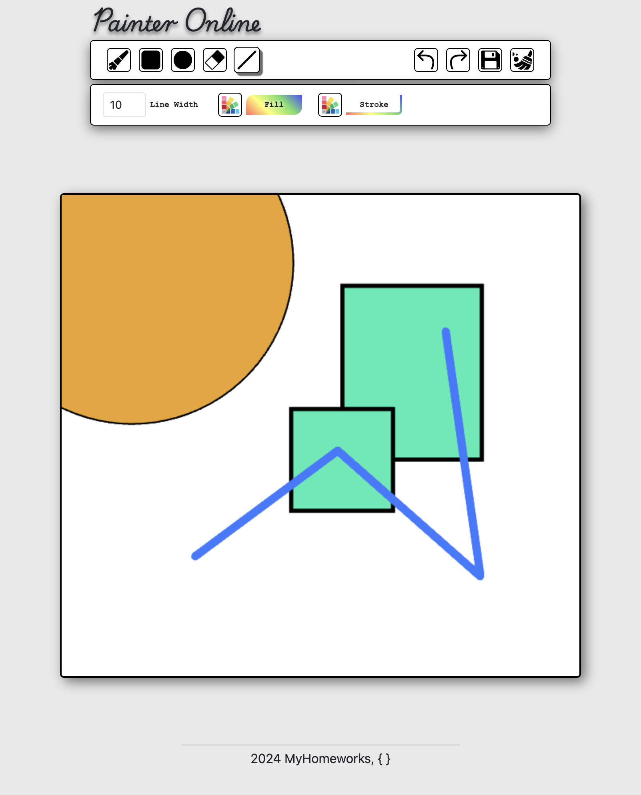

## App Description &#128196;

### <div style="text-align: start;">PainterOnline</div>

<p>This is a online painter app based on such technologies as React, Redux, NodeJS, Express.<br> Server is based both on websocket and http protocols.<br> Users can paint on the canvas at the same time with live canvas rerendering.</p>

## Launch instructions &#128196;

  Technologies used:

- **Frontend**:
  - React;
  - Redux-Toolkit;
  - Bootstrap;
  - React-bootstrap;
  - HTML/SCSS;
  - Canvas API;
  
- **Backend**:
  - NodeJS (ExpressJS);
  - Websockets/HTTP;

<div style="text-align: end;">
<p><i>Necessary prerequisites:<br> Git, Node and npm should be installed locally on Your PC.</i></p>
</div>

1. Clone repository to your **local_folder**. After that, folder "PainterOnline" must be created in Your **local folder** automatically;

    ```
    cd local_folder && git clone <https://github.com/MarkDanilchenko/PainterOnline.git>
    ```

2. Install all server necessary dependencies:

    ```
    cd PainterOnline/server && npm install
    ```

3. Install all client necessary dependencies::

    ```
    cd PainterOnline/client && npm install
    ```

4. **First** start **server**:

    ```
    cd PainterOnline/server && npm run start
    ```

5. **Second** start **client**:F

    ```
    cd PainterOnline/client && npm run demo
    ```

6. Open app on the URL <http://127.0.0.1:5000> in your browser;

7. To stop the server/client:

    ```
    Ctrl + C
    ```

<br>

<div style="font-size: small;">
  <i>
    p.s. You can change the default api server's host:port in .env.public.
    Make sure that HOST_SERVER & REACT_APP_HOST_SERVER and PORT_SERVER & REACT_APP_PORT_SERVER have the same values.
  </i>
</div>

### APP Screenshots

1. *PainterOnline in use*

<div align="center">
    
</div>

<br>

---
